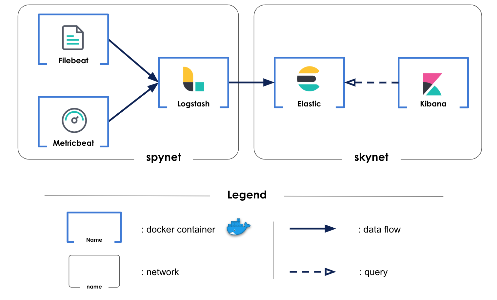

# Aura_infrastructure
Ansible/Docker project for operating Aura's servers

## How to contribute
Please refer to [How To Contribute](https://github.com/Aura-healthcare/Aura_infrastructure/blob/master/CONTRIBUTING.md)

## tl;dr
Create the `group_vars/all/secrets.yml` file with the following variables:
```
jupyter_client_id: <GitHub OAuth application Client ID for JupyterHub>
jupyter_client_secret: <GitHub OAuth application Client Secret for JupyterHub>
```

`ansible-playbook -vv --diff -i inventories/prod.yml install.yml [-t time_series_db -t jupyter -t reverse_proxy]`

### Prerequisites
 * [Ansible v2.4.2](https://www.ansible.com/)
 * The server has to have a user `aura` with following `/etc/sudoers` configuration : `aura  ALL=(ALL)    NOPASSWD:  ALL`

## Development environment
### Prerequisites
 * [Vagrant v1.8.6](https://www.vagrantup.com/)
 * To have a public ssh key on your local machine on location : `~/.ssh/id_rsa.pub`
### tl;dr
 0. (only once) : `echo -e "192.168.33.22\tdb.aura.healthcare.local" | sudo tee -a /etc/hosts`
 1. `vagrant up`
 2. `ansible-playbook -i inventories/dev.yml install.yml [-t time_series_db -t reverse_proxy, ...]`
 3. Enjoy
 4. `vagrant destroy` 

### Usage
Your local vagrant environment is configured inside the inventory `inventories/dev.yml`.

You can run any playbook on this environment.

To have a local url that route to this development environment you can add this line in your hosts file (/etc/hosts) : `192.168.33.22   db.aura.healthcare.local`

Once you have executed the `vagrand up` command and run the `install.yml` playbook on the development environment you can change the configuration of the mobile app to use the `db.aura.healthcare.local` url, you can do any test.

You can ssh to the virtual machine with `ssh ansible@192.168.33.22` 


## ELK stack

Five docker containers compone a monitoring plateform



### Filebeat

Filebeat is a lightweight logs shipper. It is only used to recover logs from all docker containers.

### Metricbeat

Metricbeat is a lightweight metric shipper. It is only used to recover metrics from all docker containers.

### Logstash

Two logs files are created to gather informations about data loading in influxdb database. Logstash harvests, transforms and analyzes these logs and sends them to elasticsearch.

Metrics and logs from above-mentionned beat logs shippers are also retrieved by logstash but not processed. They are also sent to elasticsearch.

### Elasticsearch

Elasticsearch stores and index data sent by logstash. Using logstash as output for beat logs shippers forces to load manually indexes templates.
    - filebeat-6.6.2-* is used for docker containers logs from filebeat
    - metricbeat-6.6.2-* is used for docker containers metrics from metricbeat
    - logstash-* is used for personal logs harvested by logstash itself

### Kibana

Kibana is used to display relevant dashboard. Two dashboard are uploaded in kibana.

The container_monitoring_dashboard allows to follow docker containers system metrics. It displays CPU, memory, number of container etc ...

The influxdb_monitoring_dashboard monitors the influxdb container. This dashboard displays influxdb's metrics. It adds two visualizations :
    - Nb input / time displays the total amount of data about to be stored during an injection along the time.
    - Nb output / time displays the total amount of data stored in the database during an injection along the time.

To load your own dashboard, follow the steps:
    - create your visualizations with the kibana UI
    - create your dashboard with the kibana UI using the visualizations you have created before
    - download your dashboard's json format using the REST API:
        `curl -X GET "kibana.aura.healthcare.local:80/api/kibana/dashboards/export?dashboard=*id*" -H 'kbn-xsrf: true'`
        replace *id* by yout dashboard's id in kibana
    - add the json script in a file in /kibana/files
    - add a task in /kibana/tasks/run_container.yml (just copy paste a load task and change the file in the body module) to upload your dashboard in kibana each time you rebuild the stack.